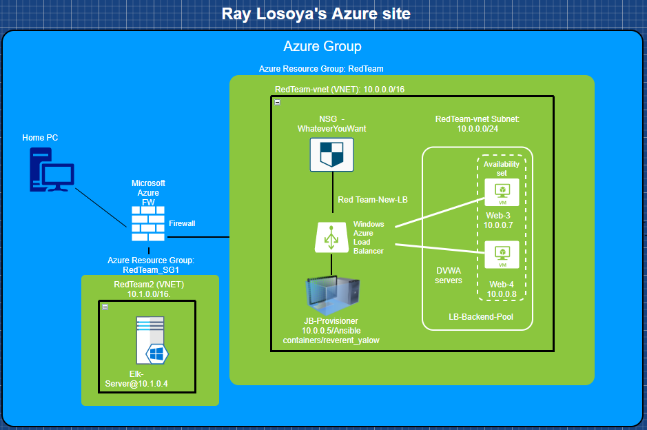

Automated ELK Stack Deployment

The files in this repository were used to configure the network depicted below.

These files have been tested and used to generate a live ELK deployment on Azure. They can be used to either recreate the entire deployment pictured above. Alternatively, select portions of the [Install Applications](Ansible/ConfigureVMwithDocker.txt) file may be used to install only certain pieces of it, such as Filebeat.

[Install Elk-Server](Ansible/ConfigureElkwithDocker.txt)

[Install applications using Ansible](Ansible/ConfigureVMwithDocker.txt) 

[Filebeat Playbook](Ansible/Filebeat-playbook.txt)

[Metricbeat Playbook](Ansible/Metric-playbook.txt)

This document contains the following details:
- Description of the Topology
- Access Policies
- ELK Configuration
  - Beats in Use
  - Machines Being Monitored
- How to Use the Ansible Build

### Description of the Topology

The main purpose of this network is to expose a load-balanced and monitored instance of DVWA, the Damn Vulnerable Web Application.

Load balancing ensures that the application will be highly available, in addition to restricting access to the network.

Integrating an ELK server allows users to easily monitor the vulnerable VMs for changes to the logs and system metrics.

| Name                 	| Function                        	| IPv4 Address 	| OS                 	|
|----------------------	|---------------------------------	|--------------	|--------------------	|
| Jump-Box-Provisioner 	| Gateway                         	| 10.0.0.4     	| Ubuntu 18.04.5 LTS 	|
| Elk-Server           	| Elasticsearch, Logstash, Kibana 	| 10.1.0.4     	| Ubuntu 18.04.5 LTS 	|
| Web-3                	| DVWA1                           	| 10.0.0.7     	| Ubuntu 18.04.5 LTS 	|
| Web-4                	| DVWA2                            	| 10.0.0.8     	| Ubuntu 18.04.5 LTS 	|

### Access Policies

The machines on the internal network are not exposed to the public Internet. 

Only the Jump-Box-Provisioner machine can accept connections from the Internet. Access to this machine is only allowed from the following IP address:
- `<Your home IP Address>`

Machines within the network can only be accessed by container reverent_yalow on Jump_Box-Provisioner or JBP itself.

A summary of the access policies in place can be found in the table below.

| Name                 	| Publicly Accessible  	| Allowed IPv4 Addresses                          	|
|----------------------	|----------------------	|-------------------------------------------------	|
| Jump-Box-Provisioner 	| Yes                  	| Home IPv4 address AND RedTeam-vnet @10.0.0.0/16 	|
| Elk-Server           	| Yes                  	| Home IPv4 address AND RedTeam2 @10.1.0.0/16     	|
| Web-3                	| No                   	| RedTeam-vnet @10.0.0.0/16                       	|
| Web-4                	| No                   	| RedTeam-vnet @10.0.0.0/16                       	|

### Elk Configuration

Ansible was used to automate configuration of the ELK machine. No configuration was performed manually, which is advantageous because this allows for several unmanaged deployments which saves times and resources. 

The playbook implements the following tasks:
- Install docker
- Install python3-pip
- Install docker module
- Configure memory
- Download and launch a docker ELK container
- Enable docker service on boot

The following screenshot displays the result of running `docker ps` after successfully configuring the ELK instance.

### Target Machines & Beats
This ELK server is configured to monitor the following machines:
- Web-3 10.0.0.7
- Web-4 10.0.0.8

We have installed the following Beats on these machines:
- Filebeat
- Metricbeat

These Beats allow us to collect the following information from each machine:
- Filebeat collects log data and infomation from the system log events from each system to keep an accurate timeline of events in case of compromise or not normal behaviors.
- Metricbeat collects system information such as resources (CPU/RAM/vMemory usage) and network traffic. 

### Using the Playbook
In order to use the playbook, you will need to have an Ansible control node already configured. Assuming you have such a control node provisioned: 

SSH into the control node and follow the steps below:
- Copy the configuration files to your provisioned servers
- Update the ansible hosts file (/etc/ansible/hosts) to the IPs of your provisioned servers
- Run the playbook, and navigate to localhost:5601/setup.php to check that the installation worked as expected
- The playbook file is the .yml file at /etc/ansible/files/filebeat-config.yml which should be copied from its source and sent to /etc/filebeat.xxxx.yml on the receiving system
- In order to make Ansible run a playbook on a specific system, you must update the hosts file at /etc/ansible/hosts
- Each playbook should be organized by what actions need to be taken and on what systems. Hosts files will need to changed to reflect what systems Ansible must push commands to 
- Navigate to localhost:5601/app/kibana (Elk-Server) to make sure the site is up
